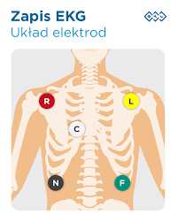
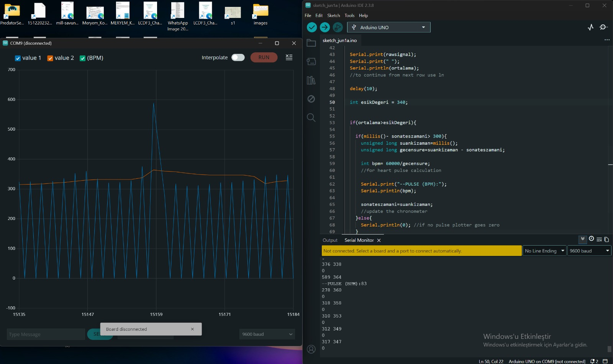
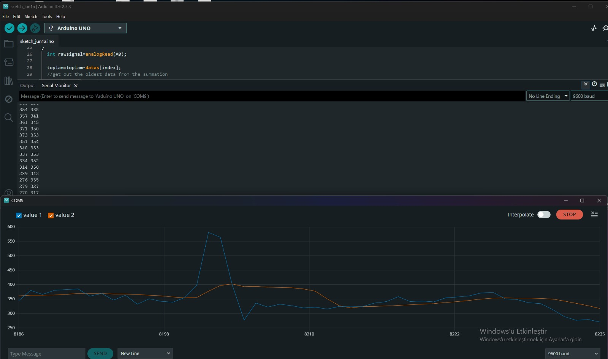
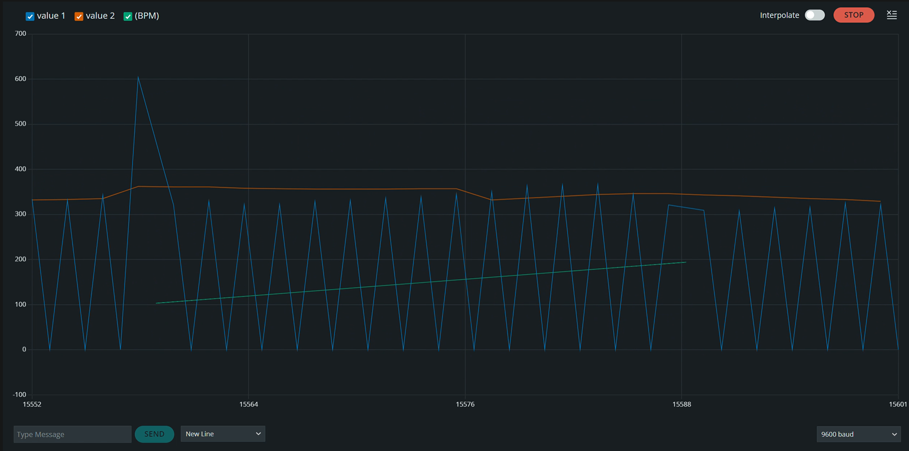
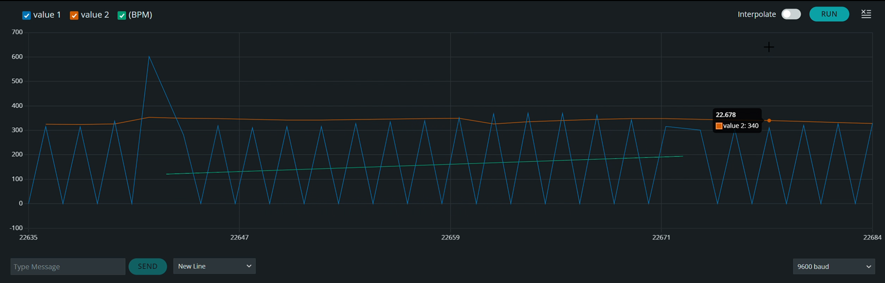
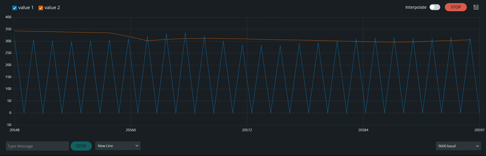
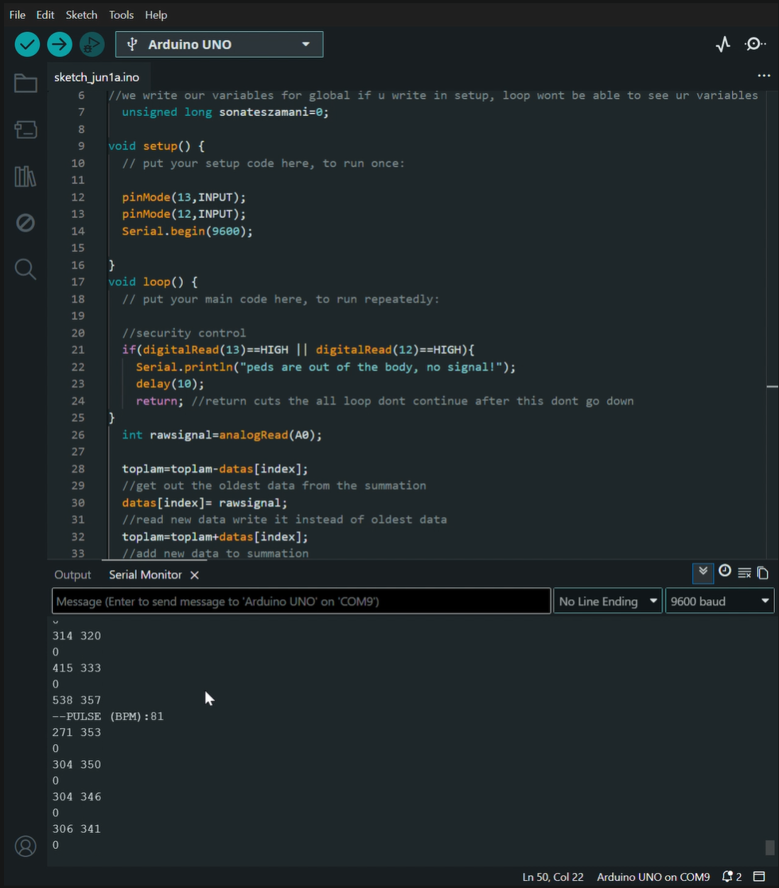

# ECG-Signal-Processing-Arduino
# Real-Time ECG Signal Processing and Heart Rate (BPM) Measurement System

This project is an embedded system application developed to filter, denoise, and calculate the real-time heart rate (BPM) from analog ECG (Electrocardiography) signals acquired from the human body using an AD8232 Biopotential Sensor and Arduino, utilizing both hardware and software filtering techniques.

## 🚀 Project Overview and Engineering Approach

Biological signals (at the mV level) contain a high amount of mains noise (50Hz) and muscle (EMG) artifacts. In this project:
1. **Hardware Filtering:** The signal was amplified using the instrumentation amplifier (Op-Amp) inside the AD8232, and main noise sources were suppressed via CMRR (Common Mode Rejection Ratio).
2. **Software Filtering (DSP):** The raw signal read through the ADC (Analog-Digital Converter) was passed through a "Moving Average" filter using a **Circular Buffer** algorithm, digitally dampening instantaneous micro-spikes and ADC fluctuations.
3. **BPM Algorithm:** R-Peak detection was performed on the filtered signal, and the time between two consecutive peaks (RR Interval) was measured using the `millis()` function to calculate the heart rate per minute. A software "Debounce" (refractory period) time was added to prevent double-triggering.

## 📂 Repository Structure

This repository contains two different code files based on their complexity level:

* **`src/01_Basic_ECG_Filter/`** : The basic code that reads the raw analog data from the sensor, checks for disconnected pads (Leads-off detection), and smooths the signal with a moving average filter. (Ideal for observing waveforms via Serial Plotter).
* **`src/02_ECG_BPM_Calculator/`** : The advanced code that calculates real-time BPM by capturing peak points from the filtered signal.

## ⚙️ Hardware Setup (Pinout)

The hardware connections of the system are as follows:

| AD8232 Pin | Arduino Pin | Function |
| :--- | :--- | :--- |
| **GND** | GND | Ground (Reference) |
| **3.3V** | 3.3V | Power Supply *(WARNING: DO NOT USE 5V)* |
| **OUTPUT** | A0 | Analog ECG Signal Output |
| **LO-** | D12 | Leads-off Detect (Negative) |
| **LO+** | D13 | Leads-off Detect (Positive) |
| **SDN** | Not Connected (or 3.3V) | Shutdown Mode (Active Low) |

> **⚠️ Safety Warning:** Ensure that your computer's charging adapter is not plugged into the mains (run only on battery) during biological signal readings. This prevents mains noise and ensures electrical safety (Galvanic isolation).

## 📊 Sample Output

