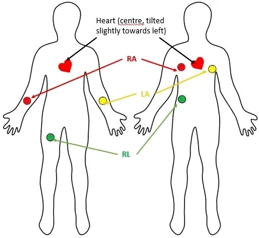

# ECG-Signal-Processing-Arduino
# Real-Time ECG Signal Processing and Heart Rate (BPM) Measurement System

This project is an embedded system application developed to filter, denoise, and calculate the real-time heart rate (BPM) from analog ECG (Electrocardiography) signals acquired from the human body using an AD8232 Biopotential Sensor and Arduino, utilizing both hardware and software filtering techniques.

## 🚀 Project Overview and Engineering Approach

Biological signals (at the mV level) contain a high amount of mains noise (50Hz) and muscle (EMG) artifacts. In this project:
1. **Hardware Filtering:** The signal was amplified using the instrumentation amplifier (Op-Amp) inside the AD8232, and main noise sources were suppressed via CMRR (Common Mode Rejection Ratio).
2. **Software Filtering (DSP):** The raw signal read through the ADC (Analog-Digital Converter) was passed through a "Moving Average" filter using a **Circular Buffer** algorithm, digitally dampening instantaneous micro-spikes and ADC fluctuations.
3. **BPM Algorithm:** R-Peak detection was performed on the filtered signal, and the time between two consecutive peaks (RR Interval) was measured using the `millis()` function to calculate the heart rate per minute. A software "Debounce" (refractory period) time was added to prevent double-triggering.

## 📂 Repository Structure

This repository contains two different code files based on their complexity level:

* **`src/01_Basic_ECG_Filter/`** : The basic code that reads the raw analog data from the sensor, checks for disconnected pads (Leads-off detection), and smooths the signal with a moving average filter. (Ideal for observing waveforms via Serial Plotter).
* **`src/02_ECG_BPM_Calculator/`** : The advanced code that calculates real-time BPM by capturing peak points from the filtered signal.

## ⚙️ Hardware Setup (Pinout)

The hardware connections of the system are as follows:

| AD8232 Pin | Arduino Pin | Function |
| :--- | :--- | :--- |
| **GND** | GND | Ground (Reference) |
| **3.3V** | 3.3V | Power Supply *(WARNING: DO NOT USE 5V)* |
| **OUTPUT** | A0 | Analog ECG Signal Output |
| **LO-** | D12 | Leads-off Detect (Negative) |
| **LO+** | D13 | Leads-off Detect (Positive) |
| **SDN** | Not Connected (or 3.3V) | Shutdown Mode (Active Low) |

> **⚠️ Safety Warning:** Ensure that your computer's charging adapter is not plugged into the mains (run only on battery) during biological signal readings. This prevents mains noise and ensures electrical safety (Galvanic isolation).

## The Electrophysiology Behind the System: How We Read the Heart

To accurately process the ECG signals using the AD8232 module and Arduino, it is crucial to understand the biological hardware we are interfacing with: the human heart and its electrical vectors.

### 1. The Electrode Logic: Differential Amplification & Grounding
Electrical current flows due to a potential difference. As the heart beats, it generates a 3D electrical vector, generally traveling from the top right of the chest toward the bottom left.

* **RA (Right Arm / -) and LA (Left Arm or Leg / +):** By placing the negative electrode on the right side and the positive on the left, we configure the AD8232 to act as a highly sensitive biological voltmeter. As the depolarization wave travels from the negative pole to the positive pole, the sensor reads and amplifies this potential difference.
* **RL (Right Leg / GND - The Green Cable):** The human body acts as a giant antenna, picking up 50Hz alternating current (AC) noise from surrounding wall outlets and electronic devices. The GND electrode provides a stable reference point to the AD8232, telling the system: *"This is the ambient noise of the body; filter it out."* Without this critical grounding, the raw signal would be completely buried under environmental interference.

### 2. Anatomy of the Signal: The QRS Complex and Our Trigger Algorithm
The heart's mechanical pumping is driven by electrical commands called **depolarization**—a rapid shift in cellular ionic charges. 

* **The Atria (P Wave):** The natural pacemaker (SA Node) fires, causing the smaller upper chambers (atria) to contract. This generates a very small electrical spike.
* **The AV Node Delay:** The electrical signal is intentionally delayed at the center of the heart to allow blood to fill the lower chambers. This creates the flat baseline (isoelectric line) seen in our graphs.
* **The Ventricles (The Massive QRS Spike):** The ventricles are the massive, thick muscle chambers responsible for pumping blood to the entire body. When the electrical wave hits them, they depolarize simultaneously with immense force. 
* **Software Integration:** This violent ventricular depolarization generates the highest voltage output in the entire cardiac cycle, which corresponds to the massive, sharp peak in our plotter (The QRS Complex). Because this spike is so distinct, our algorithm sets a high trigger threshold (`rawsignal > 600`) to specifically capture this exact moment of ventricular contraction, bypassing smaller waves (like P or T waves) and baseline wander.

  

## 📊 Sample Output

